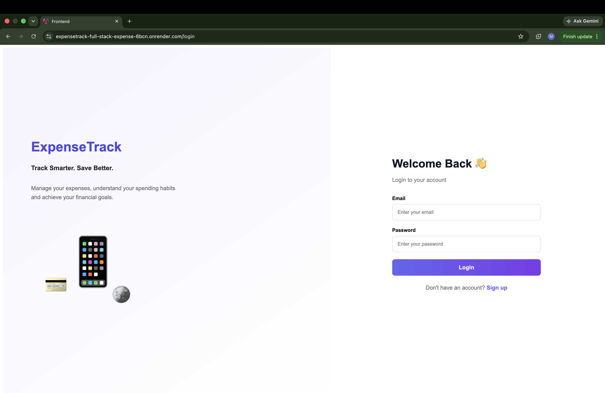
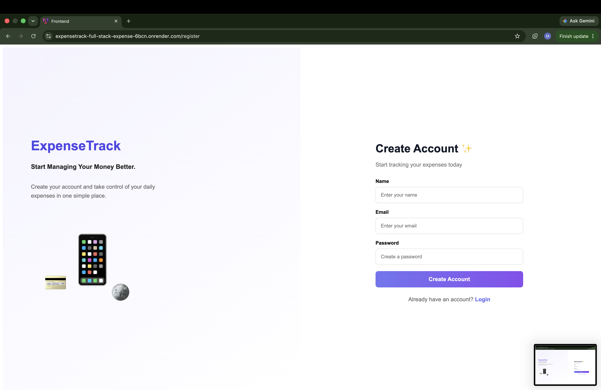
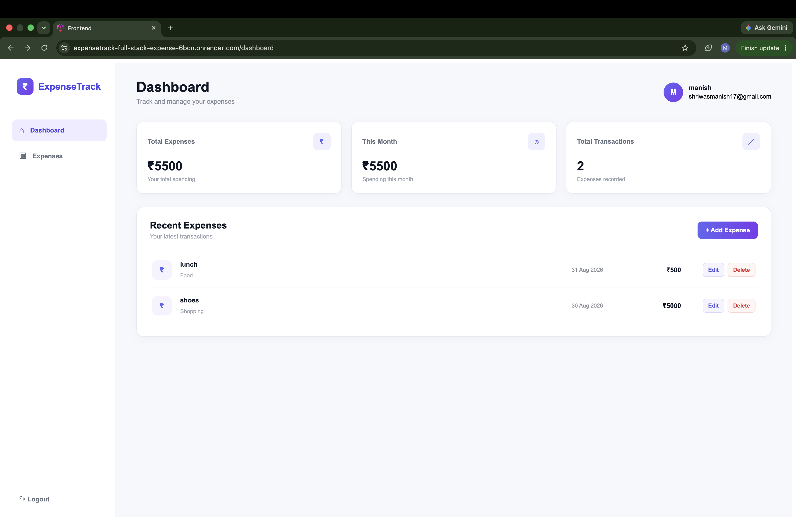
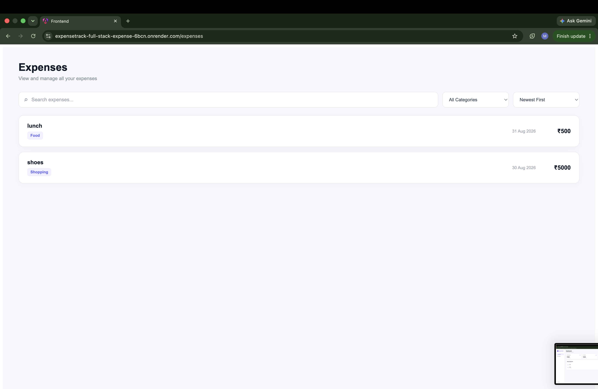
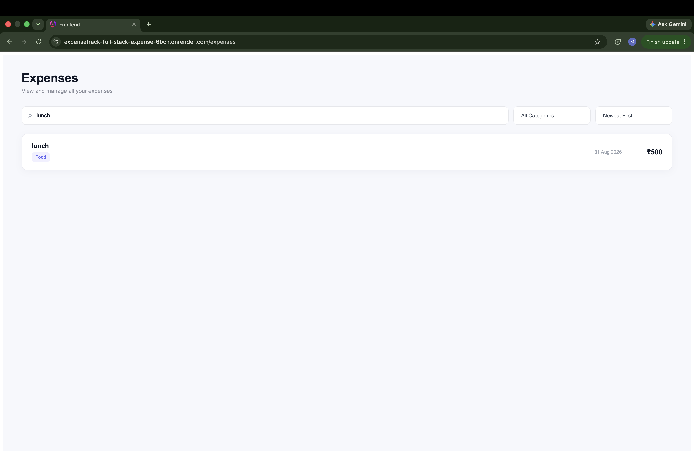
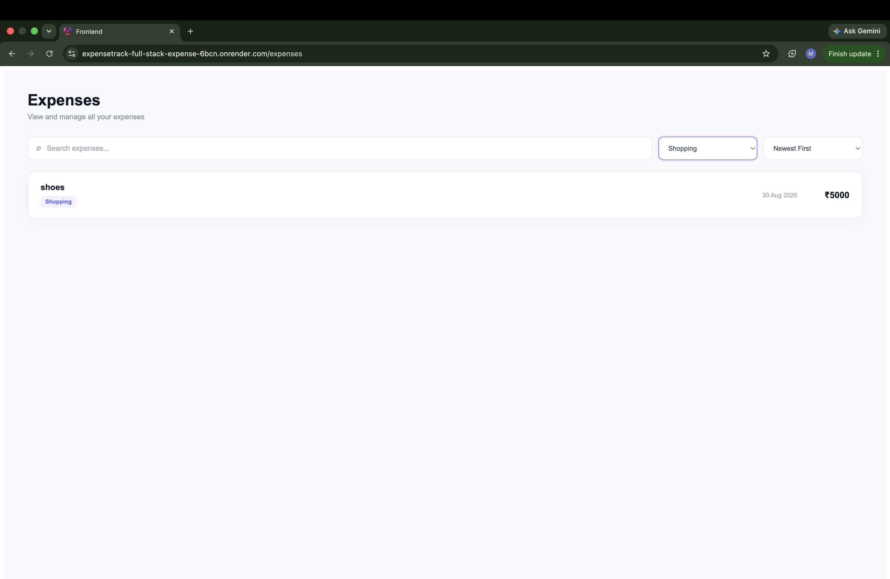

# ExpenseTrack — Full-Stack Expense Management Application

ExpenseTrack is a full-stack expense management application that allows users to securely manage and track their personal expenses.

## Tech Stack

### Frontend

- Angular
- TypeScript
- HTML
- CSS
- RxJS

### Backend

- Node.js
- Express.js
- Mongoose
- JWT
- bcrypt

### Database

- MongoDB Atlas

---

# Project Development

This project is being developed as a 4-day capstone project.

## Day 1 — Backend Foundation & Authentication

### Completed

- Node.js project setup
- Express.js server setup
- ES Modules configuration
- Backend folder structure
- Environment variable configuration
- MongoDB Atlas connection
- Mongoose setup
- User model
- Expense model
- JWT authentication
- Password hashing with bcrypt
- User registration
- User login
- Protected authentication route
- Authentication testing with Postman

## Day 2 — Backend Expense APIs

Today, I completed the core Expense Management backend for ExpenseTrack.

### Completed

- Created Expense CRUD APIs
- Create Expense
- Get All Expenses
- Get Single Expense
- Update Expense
- Delete Expense
- Added JWT protected expense routes
- Linked each expense with the logged-in user
- Tested APIs using Postman
- Verified user-specific expense access

### API Routes

- `POST /api/expenses`
- `GET /api/expenses`
- `GET /api/expenses/:id`
- `PUT /api/expenses/:id`
- `DELETE /api/expenses/:id`

## Day 3 — Angular UI & API Integration

Today I worked on:

- Built Angular UI components.
- Created and integrated Angular services.
- Used HttpClient for API communication.
- Implemented Angular routing and navigation.
- Added Functional AuthGuard for protected routes.
- Implemented HTTP Interceptor for JWT authentication.
- Connected frontend with backend APIs.

## Day 4 — Capstone: Integrate & Polish

Today I worked on:

- Integrated the complete end-to-end authentication flow.
- Added loading states for API operations.
- Added error handling for failed API requests.
- Implemented empty states for expenses.
- Polished the Angular UI.
- Fixed bugs and improved the overall user experience.
- Tested the complete application flow from login to expense management.

##  Day 5 — Deployment & Final Testing

Today I worked on deploying and testing the complete ExpenseTrack application.

## Deployment

* Deployed the Angular frontend on Render.
* Deployed the Node.js/Express backend on Render.
* Connected the frontend with the deployed backend API.
* Configured the production API URL.
* Tested the application after deployment.

## Live Application

### Frontend

https://expensetrack-full-stack-expense-6bcn.onrender.com

### Backend API

https://expensetrack-full-stack-expense.onrender.com

## Final Testing

* User Registration
* User Login
* JWT Authentication
* Protected Routes
* Dashboard
* Add Expense
* View Expenses
* Edit Expense
* Delete Expense
* Search & Filter
* Logout
* Current User Details
* Loading / Error / Empty States

## Screenshots

### Login

### Register

### Dashboard

### Add Expense

### Edit Expense

### All Expenses

### Search Expense

### Filter Expense

The ExpenseTrack application is successfully deployed and the complete end-to-end flow has been tested.

